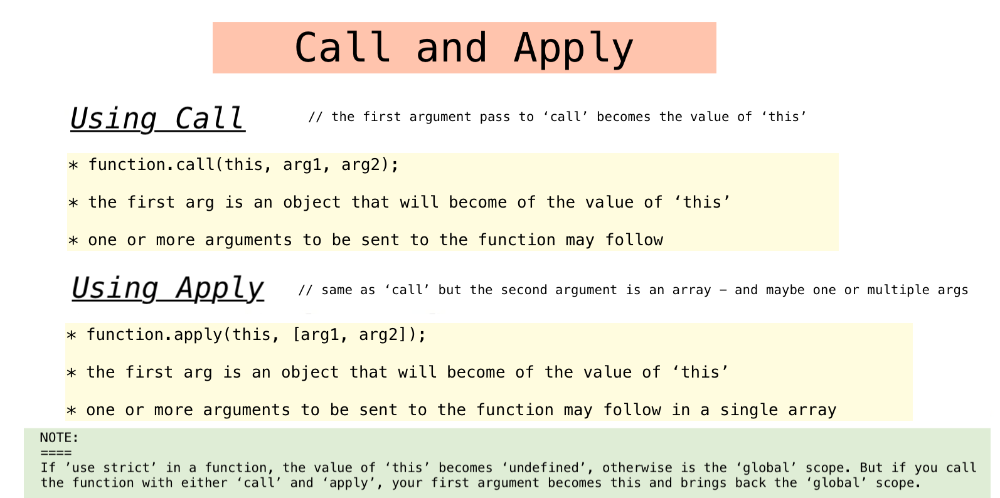
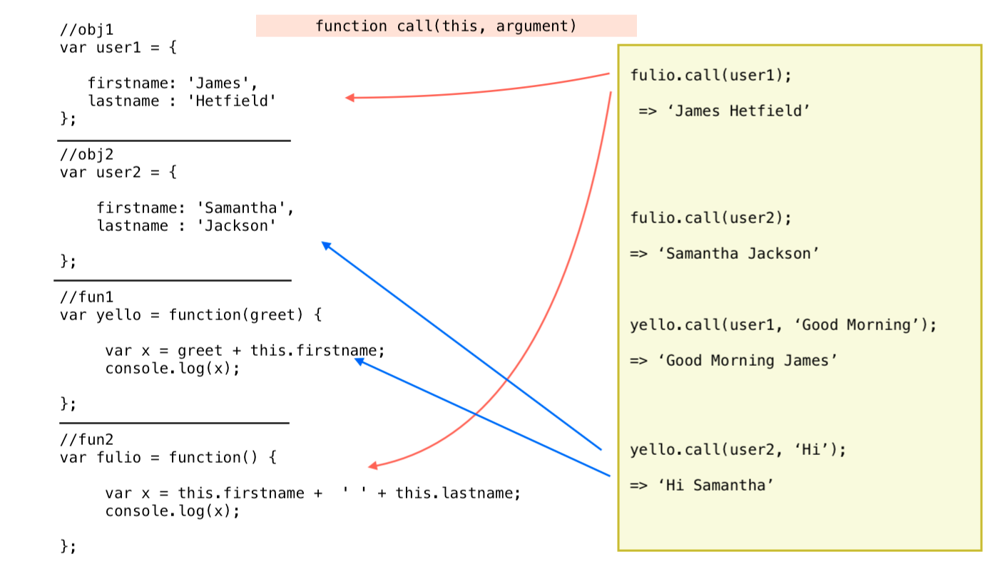
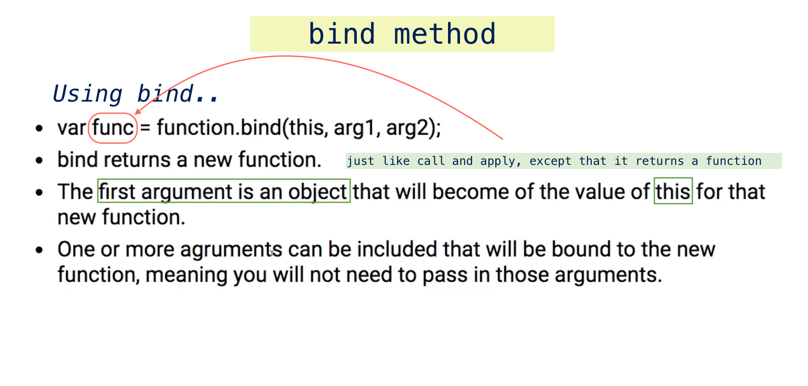

# call() and apply(), and bind() function methods


- both allow us to change the value of 'this' as if they were a method of some other object- by binding this to an object of our own choosing

```
    ex:

    var greeting = function() {

      console.log('Good Morning');
    }
  

    //execute fn

    greeting();
    => 'Good Morning'

    or

    //why to execute a function this way? to determine the value of 'this'

    greeting.call();
    => 'Good Morning'

    or

    greeting.apply();
    => 'Good Morning'


    note:
    =====

    var greeting = function() {
      console.log(this);
      console.log('Good Morning');

    };

    => global scope
    => 'Good Morning'

    var greeting = function() {
      'use strict';
      console.log(this);
      console.log('Good Morning');

    };

    => undefined
    => 'Good Morning'


```

<br/>
<kbd>call and apply methods</kbd><br/>
   

 
 <br/>


```
    ex: using call method

    //obj1

    var user1 = {
      firstname: 'James',
      lastname : 'Hetfield',
      fullname: function() {
        return this.firstname + ' ' + this.lastname;
      }

    };

    //obj2

    var user2 = {
      firstname: 'Sandy',
      lastname : 'Westfield',
      fullname: function() {
        return this.firstname + ' ' + this.lastname;
      }
    }

    //fun1

    var greeting = function(greet) {
      console.log(greet + " " + this.firstname);

    };

    //fn invocation

    greeting.call(user1,"Good Morning");

    => 'Good Morning James'


```

<br/>
<kbd>call method</kbd><br/>



<br/>


#### apply method

- works exactly as apply except for the way the arguments are passed in
- passed as an array; which would have the arguments for the function
- you pass in the arguments as a single array value

```
    ex:

    ... from previous example

    //greeting fn

    var greeting = function(greet, punct) {

        console.log(term + " " + this.firstname + punct);
    }

    //fn invocation with apply

    greeting(user1, ["Good Afternoon", "!"]);

    => 'Good Afternoon James!'

```


> call and apply allow you to bind 'this' to an object of your choosing


##### note:

```
    //*- you can also use 'fullname' method in user1 to get first and last from
    //*- user2

    console.log(user1.fullName.call(user2));

    => 'Sandy Westfield'


```


### bind() function method

- the bind method which belongs on the prototype of functions is similar to
  'call' and 'apply' but has a few unique differences

- 'bind' like 'call' and 'apply' are used to determine the value of 'this' when
  a function is invoked

- ***unique*** about ***bind*** is that 'bind' creates a new function, and that
  new function that is created, already has 'this' bound to a specific object,
  and it's the object that you pass in when you use bind.

- you can also pass other arguments to that function


<br/>
<kbd>bind method</kbd><br/>



<br/>


```
    ex: using call method

    //obj1

    var user1 = {
      firstname: 'James',
      lastname : 'Hetfield',
      fullname: function() {
        return this.firstname + ' ' + this.lastname;
      }

    };

    //obj2

    var user2 = {
      firstname: 'Sandy',
      lastname : 'Westfield',
      fullname: function() {
        return this.firstname + ' ' + this.lastname;
      }
    }

    //fun1

    var greeting = function(greet, punct) {
      console.log(greet + " " + this.firstname + punct);

    };

    //fn invocation

    var morningGreet = greeting.bind(user1,"Good Morning");

    var afternoonGreet = greeting.bind(user1,"Good Afternoon");
   
    var nightGreet = greeting.bind(user1,"Good Evening");

    morningGreet('!');
    => 'Good Morning James!'

    afternoonGreet('.');
    => 'Good Afternoon James.'

    nightGreet('?');
    => 'Good Evening James?'

    morningGreet();
    => 'Good Morning James'

```


