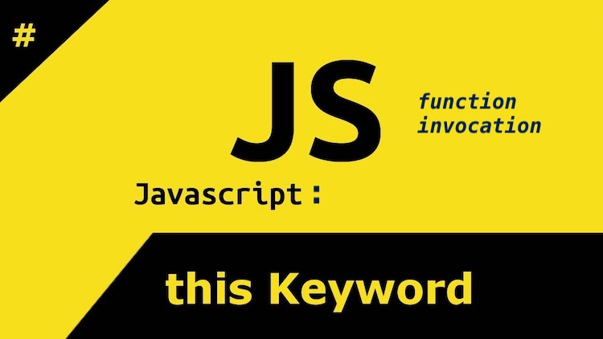

# Invoking functions and 'this' review

> the manner a function is invoke has an affect on the value of 'this'
> how is invoked determines the value of 'this'.

 

&nbsp; &nbsp; &nbsp; 

 

1- `regular` function invocation
    * it sets the value of 'this' to the global scope
    * unless you're on `strict mode`, which then set this value of `this` to  
      ___undefined___

2- function invoked as a `method`
    * is a function that exists on an object and is invoked as part of that object,
      the value of this becomes part of that object

3- function invoked as a `constructor`
    * anytime the ___new___ keyword is used, it creates a new object
    * `this` is bound to the new object
    * any reference to `this` within the constructor function refers to that
      new objects being/or just created

4- invoking a function `indirectly` using `call()` and `apply()`
    * call and apply do the exact same thing, only difference is how the arguments
      are passed in to the function
    * `call` arguments passed in separated with a comma
    * `apply` arguments passed in as an array
    * both call and apply, you can pass an argument that will be bound to `this`
      (first parameter of call and apply).

5- invoking using `bind`
    * bind method is part of the prototype of functions
    * bind creates a new function, and lets you specify the value of `this` as 
      the first parameter to that new function.

6- invoking using `arrow` functions
    * arrow functions determine the value of `this` lexically
    * we loose the value of `this` with callback functions
    * there's no need to use `call`, `apply` or `bind` with callbacks functions,
      if we use `arrow` functions.

> unrelated - only the variable in a function expression is hoisted.
> i already knew this, but a question like this: 
> is a function expression hoisted? i said yes
> answer was `no` because only the variable is hoisted
> if you ask me, would you get an undefined were you to hoist a function
> expression? i would have said yes.

