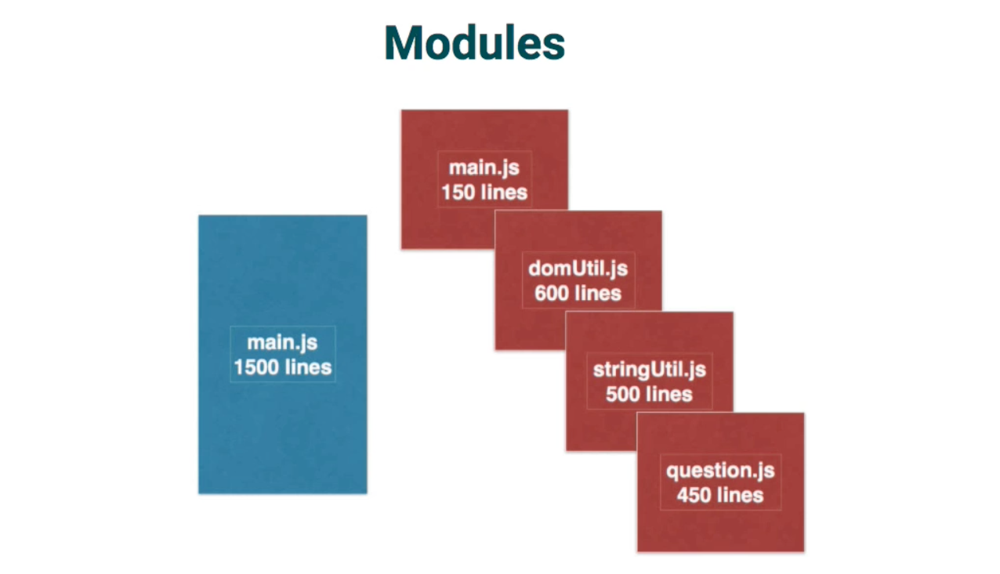
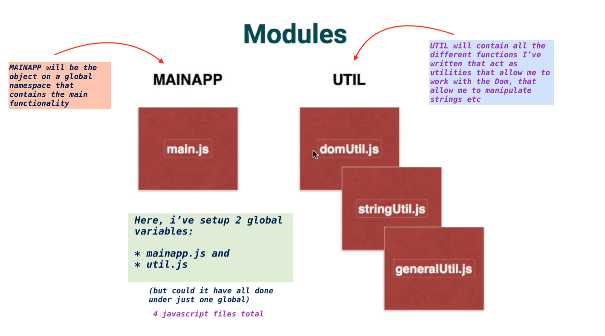

# module pattern

- it helps you break your code into manageable pieces
- generally a module is a separate javascript file
- most everything created in node is built by creating and or combining modules
- it allow us to break apart our code, things that go together logically


<kbd>modules</kbd><br/>

<br/>

- we set one or two global variables and they become our namespace
- one purpose is to compartmentalize our code into logical groupings
    + advantages:

        * easier to have multiple developers working on a project
        * the code become much more reusable
        * code easier to  understand
        * code easier to manage


-  making functions/methods public and private


<kbd>mainapp module</kbd><br/>

<br/>


### about UTIL (using same name for modules)

- lets say `domUtil` already executed and when it did, it checked to see if
  `UTIL` exist. 
- it didn't, so it created an empty object, and then it filled that empty object
  with these methods, and then it return it.

- then say `stringUtil` loads and it's invoked because it's an immediately invoked
  function expression. It checks to see if `UTIL` exist.
  It does exist, and that's what it gets passed into the variable (s)

- all of them get placed in the same global variable.


#### 2 global variables: MAINAPP, UTIL. 3 sub-modules, 4 javascript files, plus
     dependencies


<kbd>main.js</kbd>
```
    ex: main.js

    var MAINAPP = (function(nsp,quizU) {


    var domReady = function(funct) {
        document.addEventListener('DOMContentLoaded', function(){ 
            if (typeof funct === "function") {
                funct();
            }
        }, false);
    };

    
    domReady(function() {
        quizU.initQuiz();
    });


        return nsp;
        
    })(MAINAPP || {}, UTIL.quiz );

```
<br/>


<kbd>dom.js</kbd>
```
    ex: dom.js

    var UTIL = (function(d) {

    var sub = d.dom = d.dom || {};

    //dependencies
    var strx = d.string;
    
    
    /*
    DOM Functionality
    */
    var doc = document,
        $ = function(domElement) {
            if (!singleSelector(domElement)) {
                try {
                    return doc.querySelectorAll(domElement);
                } catch(e) {
                    console.log(e);
                }
            } else {
                if (domElement.indexOf('#') === 0) {
                    try {
                        return [(doc.getElementById(domElement.substring(1,domElement.length)))];
                    } catch(e) {
                        console.log(e);
                    }
                } else if (domElement.indexOf('.') === 0){
                    try {
                        return doc.getElementsByClassName(domElement.substring(1,domElement.length));
                    } catch(e) {
                        console.log(e);
                    }
                } else {
                    try {
                        return doc.getElementsByTagName(domElement);
                    } catch(e) {
                        console.log(e);
                    }
                }
            }
        },

        singleSelector = function(str) {
            var arr;
            
            arr = str.split(" ");
            if (arr.length === 1 && strx.numChar(str, "#") <= 1 && strx.numChar(str, ".") <= 1) {
                return true;
            } else {   
                return false;
            } 
        },
        assignEvent = function(de, event, funct) {
            //use for loop since node list is not an array
            try {
                for (let i = 0; i < de.length; i++) {
                    de[i].addEventListener(event, funct);
                }
            } catch(e) {
                console.log(e);
            }
            
        },
        data = function(de, term) {
            var arr = [];
            if (de.length > 1) {
                for (let i = 0; i < de.length; i++) {
                    arr[i] = de[i].getAttribute('data-' + term);
                }
            } else {
                return de[0].getAttribute('data-' + term);
            }
        },
        addClass = function(de, cls) {
            for (let i = 0; i < de.length; i++) {
                if (de[i].classList) {
                    de[i].classList.add(cls);
                } else {
                    de[i].className += ' ' + cls;
                }
            }
        },
        removeClass = function(de, cls) {
            for (let i = 0; i < de.length; i++) {
                if (de[i].classList) {
                    de[i].classList.remove(cls);
                } else {
                    de[i].className.replace(/\bcls\b/,'');
                }
            }
        };


        //public fn
        sub.$ = $;
        sub.assignEvent = assignEvent;
        sub.data = data;
        sub.addClass = addClass;
        sub.removeClass = removeClass;


        return d;


    })(UTIL || {});


```

<br/>


<kbd>quiz.js</kbd>
```
    ex: quiz.js

    var UTIL = (function(q) {

    var sub = q.quiz = q.quiz || {};

    //dependencies
    var domx = q.dom,
        $ = q.dom.$,
        strx = q.string;


    /*
    Quiz Functionality
    */
    var initQuiz = function() {
            domx.assignEvent($('.fill-in-submit.btn-primary'),'click', function() {
                hideFeedback();
                checkAnswer($('#q01_ans')[0].value);
            });
        },
        checkAnswer = function(value) {
            var ans,
                correct,
                result;

            if (value !== "") {
                ans = strx.breakOut(domx.data($('#q01'), 'answer'), ",");
                correct = ans.every(function(val) {
                    return (value.toUpperCase().indexOf(val.toUpperCase()) > -1);
                });
                result = (correct) ? 'correct' : 'incorrect';
                displayFeedback(result);
            } else {
                displayFeedback('no-answer');
            }
        },
        displayFeedback = function(result) {
            var feedback = $('.feedback.' + result);
            domx.addClass(feedback, 'visible');
        },
        hideFeedback = function() {
            var feedback = $('.feedback.visible');
            domx.removeClass(feedback, 'visible');
    };


    //public fns
    sub.initQuiz = initQuiz;
    sub.checkAnswer = checkAnswer;
    sub.displayFeedback = displayFeedback;
    sub.hideFeedback = hideFeedback;


        return q;


    })(UTIL || {});

```

<br/>


<kbd>str.js</kbd>
```
    ex: str.js

    var UTIL = (function(s) {
    // var sub =  s.string = s.string || {};
    var sub,
    sub = function(s) {
        sub = s.string,
        sub = s.string || {},
        return sub;
    };

    /*
    String Functionality
    */
    var numChar = function(str, char) {
             //return (str.match(new RegExp(char, 'g')) || []).length;
             return (str.split(char).length - 1);
        },

        breakOut = function(str, delim) {
             var arr = str.split(delim);
             return arr.map(function(val) {
                 return val.trim();
        });

    };


    //public fns
    sub.numChar = numChar;
    sub.breakOut = breakOut;


        return s;


    })(UTIL || {});


```


