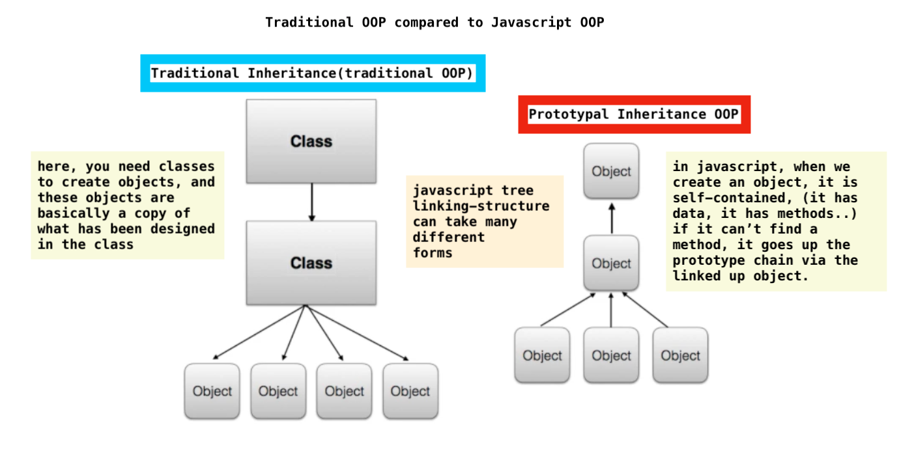
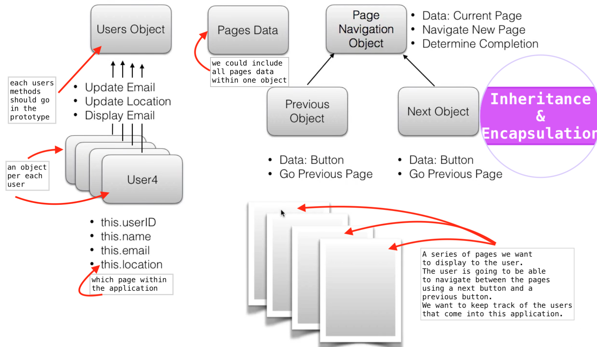

# object oriented programming. (OOP)

- found in many of the modern programming languages
- a very popular technique for code organization and architecture
- it provides an overall approach to programming
- `javascript` is an object oriented language. Most everything, except for primitives
   are an object.
- javascript `deals` with `objects diferently` than traditional object oriented
  programming languages


#### differences

- in traditional OOP, you have to create a `class` and then you can instantiate that
  class to create a new object. So ***before*** an object can be created, a class
  structure must be established.
- in javascript, you can create an object , without setting up a class.

> eventhough, the ***ES6*** identifies a class, javascript is not truly a class
  based language. Javascript's object mechanism does not automatically perform copy
  behaviou when an object is created. Instead, javascript links objects together
  using the prototype.

<br/>
<kbd>traditional vs javascript OOP</kbd>
<br/>



<br/>


### OOP - inheritance

- an object being able to inherit methods and properties from another object
- giving one object access to another objects' methods and properties
- ***enables code reuse***


### OOP - encapsulation

- enclosing all functionalities of an object(data and methods) within that object,
  so the objects internal workings are hidden from the rest of the application.

<br/>
<kbd>inheritance & encapsulation</kbd><br/>



<br/>


### OOP - setting the prototype (inheritance)

- different ways to set the prototype of an object:
- prototype is an internal link that exists on one object that references another
  object. This links exist only when a particular method doesn't exist in an object,
  therefore, it has to look further down into the prototype chain


#### prototype setting ways:

- established by` default` (object) 
  (and the default prototype is the javascript object)

- Constructor (a constructor function has a prototype property) 
  That new object becomes the prototype for that object.

- Object.create(prototype) - inside parentheses we pass a reference to the prototype

- Object.setPrototype(obj,prototype) - if an obj already created, you can
  You pass obj you want to change and the would be prototype (only availabe in ES6)

- Class Structure that imitates classical inheritance, but uses prototypal inheritance
  So when u do this, you are still establishing a prototype (ES6)

<br/>

<kbd>a random object created</kbd>

```
    ex:

    var obj3 = {

        greeting: "hi"
    };

    //it has one property greeting and value is hi

    //its default prototype is Object

    > dir(obj3);
    => Object
        greeting: "hi"
        >__proto__: Object


        //now this obj3 property greeting has nothing to do with that one of
        //Constructor

```


<kbd>object to be prototype</kbd>

```
    ex:  //creating a prototype object
         // i'll be using this obj to assign prototype to other obs
         // adding a method inside this obj

    var objProto =  {   //its going to pull greeting obj and add World

        greet: function() {
            console.log(this.greeting + ' World');
        }

    };


```


<kbd>if we want to establish the prototype of the object above, use a constructor</kbd>

```
    ex: constructor
        //we can use the constructor to assign a prototype to an object
        //obj is car and prototype to be is objProto


    var AllGreetings = function(term) {

        this.greeting = term;

    };


    //now assign a prototype

    AllGreetings.prototype = objProto;

    //now every object created from AllWheels constructor will have objProto
    //as its prototype

```


```
    ex: any object created with AllGreetings will have objProto as its prototype

    var obj1a = new AllGreetings('hi');
    var obj1b = new AllGreetings('hi');

    > dir(obj1a);

    => AllGreetings
        greeting: undefined    //this greeting property is inherited from Constructor
        > __proto__:            
            > greet:f()        //obj1a prototype (cause greet is inside objProto)
            > __proto__ Object


```


<kbd>another example</kbd>

```
    ex:

    /* Assuming AllGreetings is my constructor, and has a greeting property
       ObjProto is my prototype and has a greet method that returns:
       this.greeting + 'world'
    */

    //instance of Greeting, pointing to objProto

    var salud = new AllGreetings();         //will show as above is dir(salud)

    //i can add a name to greeting
    salud.greeting = 'hola';

    //i can use greet method to call it
    salud.greet();
    => hola world


```


#### Object.create

- it lets you set the prototype as you create the object

```
    
    ex: object created and passed the prototype that points to

    var hey = Object.create(objProto)


    //call greet in prototype

    hey.greet(); //it has greet method from prototype and a different greeting 
                //property i created here.

    => undefined world   //cause i dont have anything set for property
                         // greeting

    //set value for greeting/create greeting    
    //property                                     

    hey.greeting = 'ok';

    hey.greet();

    => ok world


```


<kbd>setPrototypeOf</kbd>

- it lets you change the prototype of an object

```
    ex:

    Object.setPrototypeOf(objx, objProto);

```


