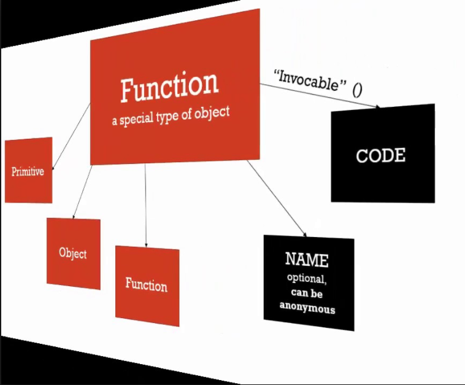

# more JS

#### :orange_book: const
- prevents reassignment of a variable (let)

- if const is used to declare an object, it will only prevent the reassigning of an object, not the changing of it.  

```
   ex.
      if i declare the following:
      const obj = {

            name = "Mike"
    
      };
      
      //the javascript engine prevents me from doing this:
      obj = {};

      //but still can do this:

      obj.name = "James";


```

- with primitives it truly acts as a constant, but not necessarily with objects.


#### about objects

- primitive data types are not objects (Strings,Numbers,Booleans,undefined,null,Symbols-ES6)
- objects are collections of values - value pairs

```
    ex: objects

        * userName: John
        * age: 32
        * address: 100 S. Main
        * city: London
        * fullAddress: function() {         //function in obj is a method of that obj
            //code to compile address
        }
        * comments: [
            "first comment",
            "second comment"
          ]


        * to access values in objects -> dot operator
        * ===========================================
          user1.userName


```


#### functions are objects

```
    ex: functions

   _Function_     
  |          |    * userName: John
  |          |    * age: 32
  |          |    * address: 100 S. Main
  |          |    * city: London
  |          |        
  |          |    * fullAddress: function() {
  |   sum    |        //code to compile address
  |          |      }
  |          |    * [[Code]]   // internal properties
  |          |    * [[Call]]   // internal properties
  |__________|


                  * we can attach properties to a function because it is an object
                    (previous object)  

                    sum.userName


```

<kbd>functions are objects</kbd>

<br>

#### two main methods for defining functions:
    
* function declarations (function statements)
* function expressions

  + Main difference:

    + function declarations are hoisted (it can be invoked before it has been defined)
    + function expressions are not hoisted


