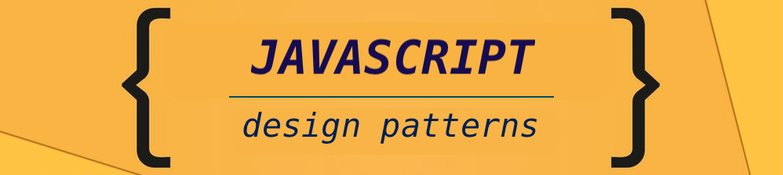

#### <kbd>:link:</kbd> `invoking functions` &nbsp;&nbsp;&nbsp;&nbsp;&nbsp;  &nbsp;&nbsp;&nbsp;&nbsp;&nbsp;<kbd>:link:</kbd> `value of this`
#### <kbd>:link:</kbd> `call & apply` &nbsp;&nbsp;&nbsp;&nbsp;&nbsp;&nbsp;&nbsp;&nbsp;&nbsp;&nbsp;&nbsp;&nbsp;&nbsp;&nbsp;&nbsp;&nbsp;&nbsp; &nbsp;&nbsp;&nbsp;&nbsp;&nbsp; <kbd>:link:</kbd> `bind`
#### <kbd>:link:</kbd> `callbacks` &nbsp;&nbsp;&nbsp;&nbsp;&nbsp;&nbsp;&nbsp;&nbsp;&nbsp;&nbsp;&nbsp;&nbsp;&nbsp;&nbsp;&nbsp;&nbsp;&nbsp;&nbsp;&nbsp;&nbsp;&nbsp;  &nbsp;&nbsp;&nbsp;&nbsp;&nbsp;&nbsp;&nbsp;&nbsp;&nbsp;<kbd>:link:</kbd> `first-class functions`
#### <kbd>:link:</kbd> `constructors` &nbsp;&nbsp;&nbsp;&nbsp;&nbsp;&nbsp;&nbsp;&nbsp;&nbsp;&nbsp;&nbsp;&nbsp;&nbsp;&nbsp;  &nbsp;&nbsp;&nbsp;&nbsp;&nbsp;&nbsp;&nbsp;&nbsp; <kbd>:link:</kbd> `prototypes`
#### <kbd>:link:</kbd> `object oriented` &nbsp;&nbsp;&nbsp;&nbsp;&nbsp;&nbsp;&nbsp;&nbsp;&nbsp;  &nbsp;&nbsp;&nbsp;&nbsp;&nbsp;&nbsp; <kbd>:link:</kbd> `functional programming`

 

<kbd>design-patterns js</kbd>
 

 

<kbd>-</kbd> &nbsp; A `design pattern` is a tried and tested solution to a common programming problem.  ___It is a best practice.___

<kbd>-</kbd> &nbsp; `Patterns` makes it ___easier___ for someone else to read and understand your code, and it ___enables___       
&nbsp; &nbsp; &nbsp; &nbsp; you to readand understand someone else's code that follows a pattern, that you're familiar with.    

<kbd>-</kbd> &nbsp; While a design pattern ___provides a possible solution___ to problems you encounter in programming,    
&nbsp; &nbsp; &nbsp; &nbsp; ___it may be a part of an approach___ you have chosen to use, or may simply recognize    
&nbsp; &nbsp; &nbsp; &nbsp; that a ___problem can be solved by using a particular pattern___.           

&nbsp; &nbsp; &nbsp; &nbsp;<kbd>+</kbd>   Ex: 
    namespace pattern, module pattern, IIFEs, and even callbacks `could be 
    considered as a pattern`. 

   > &nbsp; &nbsp; &nbsp; &nbsp; These are techniques in javascript but ***they're also a pattern***.  ___A best practice to solve certain problem___. &nbsp; :hammer:  :pizza: :beer:

