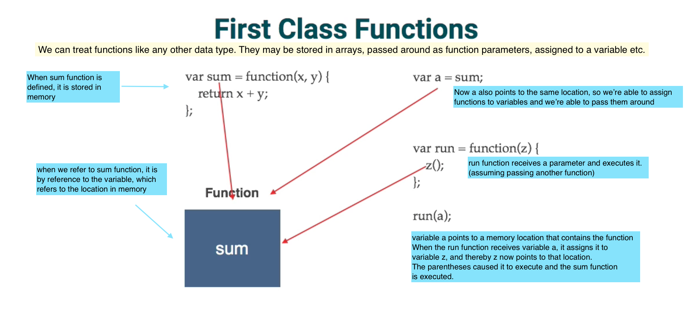

#### :link: invoking functions &nbsp;&nbsp;&nbsp;&nbsp;&nbsp; :link: value of this
#### :link: call & apply &nbsp;&nbsp;&nbsp;&nbsp;&nbsp;&nbsp;&nbsp;&nbsp;&nbsp;&nbsp;&nbsp;&nbsp;&nbsp;&nbsp;&nbsp;&nbsp;&nbsp; :link: bind
#### :link: callbacks &nbsp;&nbsp;&nbsp;&nbsp;&nbsp;&nbsp;&nbsp;&nbsp;&nbsp;&nbsp;&nbsp;&nbsp;&nbsp;&nbsp;&nbsp;&nbsp;&nbsp;&nbsp;&nbsp;&nbsp;&nbsp; :link: first-class functions
#### :link: constructors &nbsp;&nbsp;&nbsp;&nbsp;&nbsp;&nbsp;&nbsp;&nbsp;&nbsp;&nbsp;&nbsp;&nbsp;&nbsp;&nbsp;   :link: prototypes
#### :link: object oriented &nbsp;&nbsp;&nbsp;&nbsp;&nbsp;&nbsp;&nbsp;&nbsp;&nbsp;   :link: functional programming

<br/>

#### :orange_book: about `const`
- prevents reassignment of a variable (let)

- if const is used to declare an object, it will only prevent the reassigning of an object, not the changing of it.  

```
   ex.
      if i declare the following:
      const obj = {

            name = "Mike"
    
      };
      
      //the javascript engine prevents me from doing this:
      obj = {};

      //but still can do this:

      obj.name = "James";


```

- with primitives it truly acts as a constant, but not necessarily with objects.


#### :orange_book: about objects

- primitive data types are not objects (Strings,Numbers,Booleans,undefined,null,Symbols-ES6)
- objects are collections of values - value pairs

```
    ex: objects

        * userName: John
        * age: 32
        * address: 100 S. Main
        * city: London
        * fullAddress: function() {         //function in obj is a method of that obj
            //code to compile address
        }
        * comments: [
            "first comment",
            "second comment"
          ]


        * to access values in objects -> dot operator
        * ===========================================
          user1.userName


```


#### :orange_book: functions are objects

```
    ex: functions

   _Function_     
  |          |    * userName: John
  |          |    * age: 32
  |          |    * address: 100 S. Main
  |          |    * city: London
  |          |        
  |          |    * fullAddress: function() {
  |   sum    |        //code to compile address
  |          |      }
  |          |    * [[Code]]   // internal properties
  |          |    * [[Call]]   // internal properties
  |__________|


  * we can attach properties to a function because it is an object  (previous object)  

  sum.userName
  or
  var report1 = function(val) {
    console.log(val);
  }
  report1.userName = "steve";

  //since is an object

  var report3 = report1; //and just like an obj have access to userName
  report3.userName
  => 'steve'

  //changing the value of userName on report1
  report1.userName = "thomas";

  //will also change value of property in function report3
  report3.userName;
  => "thomas"

  //if you do a dir(report1) and dir(report3), they both point to report1

  //or add a function as an obj

  report3.showUser = function() {
    console.log(this.userName);    //this refers to the function
  }

  //not a copy, pointing to the same object

  var report5 = report1;

```

<kbd>functions are objects</kbd>

<br>
<br>
#### :orange_book: two main methods for defining functions:
    
* function declarations (function statements)
* function expressions

  + Main difference:

    + function declarations are hoisted (it can be invoked before it has been defined)
    
```
      ex:
        function declaration

        function functionName() {

          //code block to execute
        }


```


#### :orange_book: function expressions are not hoisted

* the variable will be hoisted, but it will not contain the actual function.   
        Therefore, if you try to execute it you receive an error.   


```
      ex:
        function expression

        var x = function functionName() {

          //code block to execute
        }


```


#### :orange_book: first class functions

- in javascript, functions are first-class objects because they can have properties
  and methods just like any other object. What distinguishes them from other objects
  is that functions can be called.

- the fact that functions are objects and because of that we're able to pass them around
  by reference, that you can assign a function into a variable, or pass it into another function


<br/>

<kbd>first class functions</kbd>



<br><br/>


```
    ex: passing a function as an argument into another fn

    //fn1
    var sum = function(x,y) {

      console.log(x + y);
    };
    

    //fn2
    ex:
    var run = function(fn,a,b) {

      console.log(fn(a,b));
    };


    ex:
    run(sum,5,5);
    =>10

    //i could just pass a different fn on the fly too (an anonymous fn)

    exrun(function(x,y) {return x*y},4,12);
    =>48

    or

    ex:
    
    run(function(x,y) {

      return x * y;

    },4,12);


```


